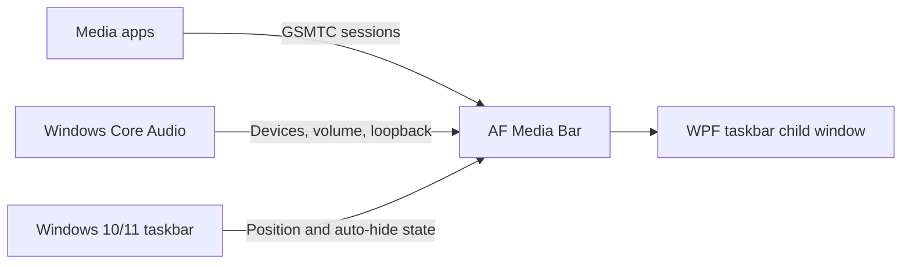

# AF Media Bar

<div align="center">

  <a href="https://github.com/Fervent-Tempo/AF-Media-Bar/releases">
    
  </a>
  <a href="https://github.com/Fervent-Tempo/AF-Media-Bar/releases">
    
  </a>
  <a href="https://github.com/Fervent-Tempo/AF-Media-Bar/stargazers">
    
  </a>
  <a href="https://github.com/Fervent-Tempo/AF-Media-Bar/issues">
    
  </a>
  <a href="LICENSE">
    
  </a>

  <br><br>

  

  <h1>AF Media Bar</h1>

  <p>Media controls, audio device switching, and lightweight system metrics on the Windows 10/11 taskbar.</p>

  <p>
    <a href="README.md">简体中文</a>
    ·
    English
    <br>
    <a href="#installation">Quick start</a>
    ·
    <a href="https://github.com/Fervent-Tempo/AF-Media-Bar/issues/new?template=bug_report.yml">Report a bug</a>
    ·
    <a href="https://github.com/Fervent-Tempo/AF-Media-Bar/issues/new?template=feature_request.yml">Request a feature</a>
  </p>

</div>

## Demo

### In Action

<div align="center">


</div>

### Introduction Video

- [Watch the AF Media Bar introduction video on Bilibili](https://www.bilibili.com/video/BV1Bjuq6bErr)

## Table of Contents


- [AF Media Bar](#af-media-bar)
  - [Demo](#demo)
    - [In Action](#in-action)
    - [Introduction Video](#introduction-video)
  - [Table of Contents](#table-of-contents)
  - [Overview](#overview)
  - [Features](#features)
  - [How It Works](#how-it-works)
  - [Installation](#installation)
    - [Requirements](#requirements)
    - [Recommended package](#recommended-package)
  - [Basic Usage](#basic-usage)
  - [Updating and Uninstalling](#updating-and-uninstalling)
    - [Updating](#updating)
    - [Uninstalling](#uninstalling)
  - [Privacy and Security](#privacy-and-security)
  - [Building from Source](#building-from-source)
  - [Project Structure](#project-structure)
  - [Contributing](#contributing)
  - [License](#license)


## Overview

AF Media Bar is a portable media controller for Windows 10 and Windows 11. It reads Global System Media Transport Controls (GSMTC) sessions, displays artwork, title, and artist, and provides previous, play/pause, next, and source switching controls.

The app runs in its own process and hosts its WPF player as a taskbar child window. Dynamic Island, Desktop Card, and Floating Orb currently appear only as unimplemented choices in Settings and do not change the runtime host. AF Media Bar does not modify or inject code into `explorer.exe`. Any player that publishes a GSMTC session can be discovered, including NetEase Cloud Music, QQ Music, Spotify, major browsers, VLC, PotPlayer, Windows Media Player, mpv, and foobar2000.

## Features

<div align="center">

| Category | Capabilities |
| --- | --- |
| Media | Previous, play/pause, next, repeat, and click-to-position or draggable progress; unavailable controls keep a transparent background and dim their icons; Full always retains explicit buttons |
| Source interaction | Bind artwork and title/lyric clicks independently to play/pause, activate the media app, or open the full layer; right-click the bar to switch sources |
| Track-change notification | Optionally show the current track after it changes and starts playing, with six placements, 1–10 second duration, fullscreen suppression, and fixed- or foreground-display targeting |
| Live lyrics | Lyrics exist only in taskbar rest and replace title plus artist/source when available; configure secondary content and alignment on the Lyrics page; lyrics are found in order across NetEase Cloud Music, LRCLIB, QQ Music, Kugou Music, and Soda Music, and word-by-word lyrics light up with playback |
| Taskbar behavior | Horizontal taskbars retain the original Rest appearance; Hover directly blurs/dims the original text while controls stay crisp, Full stays outside the taskbar, and a fixed target display can be selected independently |
| Window modes | Four cards at the top of the settings page cover Taskbar, Dynamic Island, Desktop Card, and Floating Orb; Taskbar is the only runtime mode, the other three are labeled unimplemented, and selecting one swaps the page area and shows a placeholder without switching the running window |
| Appearance | Global fonts, font weight, player text, light/dark theme, and window material; automatic text follows the actual taskbar color or wallpaper behind transparent surfaces and adds a subtle contrasting shadow on mixed backgrounds; the taskbar body is currently fixed transparent, while the island appearance (background style, opacity, radius) is shown read-only inside its own mode section |
| Interface language | Simplified Chinese, Traditional Chinese, and English interface text; the default follows the Windows display language, and a change under Application &amp; about → Application → Interface language applies immediately without restarting |
| Light customization | Rest is always enabled and exposes how much content to show, layout, title/artist alignment, spectrum, and metrics visibility; Hover and Full can be toggled with independent control/content choices; a fixed width remains bounded by the live minimum and the taskbar range |
| How much content | Minimal, Balanced, and Information presets consistently change buttons, seek width, and artwork-text-spectrum gaps; only the middle text region receives a Hover minimum, and no empty middle region is reserved while disconnected |
| Auto-hide | Hide when every media session is stopped; collapse containers use an anchor container and shared edge, while four-way collapse still requires real-Windows acceptance |
| Tray audio controls | Bind tray left-click to audio controls, Settings, or the context menu; bind plain and chorded wheel gestures to output devices or current-media volume using the same Shift/left/right key as the media bar |
| Audio devices | Switch devices in a stable ordered list; both the audio flyout and Full wheel-preview and apply after scrolling stops |
| App volume | Aggregate application icons and audio sessions across active output endpoints; the audio flyout, Full, and tray wheel adjust the selected media app in 2% steps |
| Visualizer | WASAPI loopback spectrum with four styles (bars, waveform, pixel bars, mirrored bars) that share the media text's automatic foreground and therefore follow the real background (system colours under high contrast), 9–24 bars with a fixed bar width so more bars means a wider spectrum, 5–30 Hz refresh, and adjustable jump amount; show it under Media &amp; Notifications → Rest components |
| Metrics | Rest can rotate selected system/process metrics and Full can show all four; the sampling interval is set in seconds (0.5–5 s) and clicking the Rest component opens Task Manager; disabling the Rest component releases its sampling lease when Full has no consumer |
| Low-performance fallback | When WPF reports software rendering or a low-performance path, decorative continuous motion, marquees, spectrum easing, blur, and backdrop effects are disabled automatically |

</div>

## How It Works

<div align="center">



</div>

The Windows 10/11 media card is an internal Explorer/Shell surface rather than a supported embeddable control. AF Media Bar uses the public GSMTC API behind that card and renders its own interface, avoiding Explorer injection and its stability risks.

## Installation

### Requirements

- Windows 10 version 1809 (build 17763) or later, x64
- Both the installer and the portable package are self-contained, so no separate .NET installation is required

### Option 1: installer (recommended)

1. Open [Releases](https://github.com/Fervent-Tempo/AF-Media-Bar/releases) and download `AFMediaBar-Setup-vX.Y.Z-win-x64.exe`. Do not download GitHub's automatically generated source archives.
2. Run the installer. The wizard first asks for **Simplified Chinese or English**, then shows the license, lets you **choose the install location**, and lets you install for the current user or for all users; the default is `%LOCALAPPDATA%\Programs\AFMediaBar` and needs no administrator rights.
3. A desktop shortcut is optional, the Start menu entry is always created, and the app is ready to launch when the wizard finishes.

An installed copy can check for updates while running, download them in the background, and install them silently when it exits; see "Updating and Uninstalling".

### Option 2: portable package

1. Download `AFMediaBar-vX.Y.Z-win-x64.zip` from the same Releases page.
2. Extract it to get one self-contained `AFMediaBar.exe`; the archive no longer contains hundreds of .NET runtime files.
3. Place it in a permanent writable directory, such as `D:\AFMediaBar`, and run it. The portable copy writes no registry keys and is upgraded by replacing the file manually.

Both options are published on GitHub Releases only. When GitHub is slow or unreachable, the same page can be downloaded through a GH-Proxy accelerated address (`https://<proxy-host>/https://github.com/...`); the in-app update check and download also fall back to those accelerated addresses when the direct download fails.

After launching, right-click the player or tray icon and use Display Modes, Media &amp; Notifications, Interaction, Lyrics, Appearance, and App &amp; About for light customization.

Clicking a slider in the settings selects it (its row lights up), after which the arrow keys or the wheel adjust it: one press moves one step, and holding an arrow grows the distance over time. An unselected slider never swallows the wheel, so the page still scrolls.

Pointing at the media bar or the tray icon shows a tooltip immediately: it first states what the plain wheel does, switches to the chord wheel's action while the shared modifier is held, and becomes the result that just happened after a scroll (for example "next: track name" or "source: media name"). Holding a mouse button while scrolling no longer triggers the artwork or text click, the context menu, or a tray click on release.

App &amp; About offers run-at-startup (on by default) and "save the current settings as my defaults", after which every "restore defaults" entry returns to that snapshot.

AF Media Bar is not commercially code-signed, so Windows SmartScreen may show an unknown publisher warning when you run the installer or launch the app for the first time.

## Basic Usage
<div align="center">

| Action | Result |
| --- | --- |
| Hover over the bar | With media connected, artwork, text, and the playing spectrum use independent legacy hover feedback; opening controls directly blurs/dims the original text while buttons remain crisp; when Hover is disabled, a text-region pull handle still opens Full |
| Click artwork | Play/pause by default, or bind it to activate the current media app or open the full layer |
| Click title or lyric | Activate the current media app by default, or bind it to play/pause or open the full layer |
| Open the Lyrics page | Toggle live lyrics, secondary content, and alignment |
| Scroll up/down over the media area | Bind plain and modified wheel gestures to previous/next, media-source cycling, output-device cycling, or current-media volume; defaults are previous/next and Shift + source cycling |
| Right-click the bar and choose “Switch media source” | Switch between available media sessions |
| Enable Track-change notification under Media &amp; Notifications | Show the current track only after an observable track change begins playing; configure placement, duration, fullscreen policy, and fixed/foreground display targeting |
| Choose the taskbar target display under Display Modes | Close an open Full panel and rebuild the taskbar host through its safe reload path; a disconnected target temporarily falls back to the primary display without discarding the preference |
| Disable content-length following under Display Modes | Choose a fixed value between the live Hover minimum and available taskbar length; overflowing title, artist, and lyric text scrolls within its clipped region |
| Click the AF Media Bar tray icon | Open the audio control panel by default; Interaction → Tray icon can switch it to the output-device menu, the current application's volume menu, the settings page, or the context menu |
| Scroll over the audio flyout or Full output-device row | Preview immediately and switch about 1.2 seconds after scrolling stops; Full gives long device names more room and exposes the complete name as a tooltip |
| Hover over the AF Media Bar tray icon | Show the default wheel action and its current value in the native Windows tooltip |
| Scroll over the tray icon | Plain wheel switches output devices by default; Shift + wheel adjusts current-media volume in 2% steps; device previews update the native tooltip immediately and apply after about 1.2 seconds of inactivity |
| Click the spatial-audio row | Show the current spatial format and open System > Sound > All sound devices; third-party apps cannot reliably switch Dolby/DTS modes for the system |
| Drag an empty area of the strip | Move the bar and does not drag while locked |
| Select Dynamic Island, Desktop Card, or Floating Orb | Only change the highlighted settings-page choice and show an unimplemented notice; the runtime remains in Taskbar mode |
| Place an edge-collapse container on a desktop edge | Reveal its content when the pointer enters the trigger region; hide the content after leaving |
| Right-click the bar or tray icon | Open detailed settings, media actions, or the exit menu; left-click outside to close it |

</div>

Some players require “system media controls,” “media keys,” or “SMTC” to be enabled in their own settings.

Track-change notification does not read the playback queue and is not a “next up” preview; Windows SMTC does not expose a queue. It identifies observable changes by source identifier plus normalized title, so consecutive same-title tracks from one source cannot be distinguished reliably. A real upcoming queue requires a player-specific API or plugin.

## Updating and Uninstalling

### Updating

About 20 seconds after startup the app reads the public version manifest (`docs/latest.json`), then no more than once every 24 hours; a failure is retried after an hour, and App &amp; About can check immediately. Once a newer version is found:

- the tray icon raises one system notification, and clicking it opens App &amp; About directly; the tray menu and the taskbar bar's context menu both gain a single update entry whose title follows the state (check for updates / downloading n% / ready);
- that page shows the release highlights, the download progress and every update action, and **downloading starts only when you click "download and install"** (about 70 MB, verified with SHA-256 while streaming), so the app never spends that traffic on its own;
- after verification it reports that the update is ready, and **the next time you start the app it installs first and then starts the new version** — no installer window appears right after you quit; "restart and install now" on that page does the same thing immediately;
- the installer's integrity is decided by SHA-256 alone (`size` in the manifest is informational; a wrong or missing one does not affect the update).

Downloads only use direct links: GitHub first, then the accelerated (GH-Proxy) addresses listed in the manifest, in order. When every channel fails the status shows why and offers two download-page entries, GitHub and an accelerated mirror. The installer's SHA-256 comes from the manifest, and a file that fails the check is deleted and never installed. A portable copy has no installation record, so it downloads and verifies but never installs; replace the executable by hand instead.

The install log is written to `%LOCALAPPDATA%\AFMediaBar\updates\install-<version>.log` for diagnosing a failed silent install, and downloaded installers live in the same folder, cleaned up per version on the next start.

User preferences and window state are stored in `%LOCALAPPDATA%\AFMediaBar\settings.json` using versioned JSON, atomic writes, and backup recovery. Layout profiles and component properties remain in `%LOCALAPPDATA%\AFMediaBar\profiles\layout.json`. Replacing the program file will not remove settings; the App &amp; About page can open the settings folder.

### Uninstalling

- Installed copy: uninstall AF Media Bar from Settings &gt; Apps &gt; Installed apps, or use the Start menu entry. Uninstalling removes the program directory and shortcuts only, never `%LOCALAPPDATA%\AFMediaBar`.
- Portable copy: delete the program directory.

To remove settings and any downloaded installer as well, run this in PowerShell:

```powershell
Remove-Item "$env:LOCALAPPDATA\AFMediaBar" -Recurse -Force
```


## Privacy and Security

- No telemetry, advertisements, accounts, or network analytics are included.
- Update checks request only the two public manifest endpoints (`docs/latest.json` on `raw.githubusercontent.com` and on `jsdelivr`), never through a third-party proxy. Installer downloads happen only when automatic download is enabled or when you click download; a failed direct connection may fall back to a GH-Proxy accelerated address listed in the manifest, while the installer's SHA-256 always comes from the manifest fetched from a non-proxy endpoint. Lyrics are requested in order from the public endpoints of NetEase Cloud Music, LRCLIB, QQ Music, Kugou Music, and Soda Music (one request per source, stopping at the first hit), and remote artwork requests the configured image service; those requests carry only the title, artist, album, and duration, and the app does not upload device information or user settings.
- Media metadata, system metrics, and audio operations stay on the local machine.
- The app runs as the current user, does not request elevation, and does not inject into Explorer.
- Report security issues privately according to [SECURITY.md](SECURITY.md).

## Building from Source

Windows 10 version 1809 or later, the [.NET 10 SDK](https://dotnet.microsoft.com/download/dotnet/10.0), and PowerShell are required. The repository pins the supported SDK feature band through `global.json`.

```powershell
git clone https://github.com/Fervent-Tempo/AF-Media-Bar.git
cd AF-Media-Bar
dotnet restore .\src\AFMediaBar.slnx
dotnet build .\src\AFMediaBar.slnx -c Release --no-restore
dotnet test .\src\AFMediaBar.slnx -c Release --no-build
dotnet run --project .\src\AFMediaBar\AFMediaBar.csproj
```

Create a self-contained single executable for end users:

```powershell
dotnet publish .\src\AFMediaBar\AFMediaBar.csproj -c Release -r win-x64 --self-contained true -o .\artifacts\AFMediaBar-win-x64
```

## Project Structure

```text
AF-Media-Bar/
├── .github/
│   ├── ISSUE_TEMPLATE/            # Issue forms
│   └── workflows/                 # Build and release workflows
├── src/
│   └── AFMediaBar/                # WPF application main project
│       ├── Classes/               # Core business logic and services
│       │   ├── Abstractions/      # Abstract interface definitions
│       │   ├── Converters/        # WPF value converters
│       │   ├── Interop/           # Windows API interop
│       │   ├── Models/            # Data models
│       │   │   └── Layout/        # Layout data models (LayoutSchema, ComponentConfig, etc.)
│       │   ├── Services/          # Business services
│       │   │   ├── Layout/        # Layout presets and render engine
│       │   │   ├── Lyrics/        # Lyrics service (multi-source retrieval, format detection, syllable timeline and reveal)
│       │   │   ├── Players/       # Media player services
│       │   │   └── Win32/         # Windows system services
│       │   ├── Settings/          # Settings management
│       │   └── Utils/             # Utility classes
│       ├── Components/            # Reusable UI components (TaskBarMediaControl, etc.)
│       ├── ViewModels/            # MVVM ViewModels
│       │   ├── Pages/             # Page ViewModels
│       │   └── Windows/           # Window ViewModels
│       └── Views/                 # XAML views
│           ├── Pages/             # Settings page views
│           └── Windows/           # Window views
├── docs/                          # Project documentation and assets
├── AFMediaBar.slnx                # Solution file
├── README.md                      # Chinese documentation
└── README.en-US.md                # English documentation
```


## Contributing

Read [CONTRIBUTING.md](CONTRIBUTING.md) before submitting an issue or change. Bug reports should include the Windows version, AF Media Bar version, media player, and complete reproduction steps.

See [CHANGELOG.md](CHANGELOG.md) for release history.

## License

AF Media Bar is available under the [MIT License](LICENSE).

<div align="center">

If AF Media Bar is useful to you, consider starring the repository❤️.

</div>
