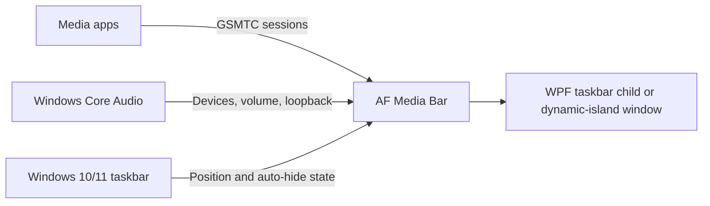

# AF Media Bar

<div align="center">

  <a href="https://github.com/Fervent-Tempo/AF-Media-Bar/releases">
    
  </a>
  <a href="https://github.com/Fervent-Tempo/AF-Media-Bar/releases">
    
  </a>
  <a href="https://github.com/Fervent-Tempo/AF-Media-Bar/stargazers">
    
  </a>
  <a href="https://github.com/Fervent-Tempo/AF-Media-Bar/issues">
    
  </a>
  <a href="LICENSE">
    
  </a>

  <br><br>

  

  <h1>AF Media Bar</h1>

  <p>Media controls, audio device switching, and lightweight system metrics on the Windows 10/11 taskbar.</p>

  <p>
    <a href="README.md">简体中文</a>
    ·
    English
    <br>
    <a href="#installation">Quick start</a>
    ·
    <a href="https://github.com/Fervent-Tempo/AF-Media-Bar/issues/new?template=bug_report.yml">Report a bug</a>
    ·
    <a href="https://github.com/Fervent-Tempo/AF-Media-Bar/issues/new?template=feature_request.yml">Request a feature</a>
  </p>

</div>

## Demo

### In Action

<div align="center">


</div>

### Introduction Video

- [Watch the AF Media Bar introduction video on Bilibili](https://www.bilibili.com/video/BV1Bjuq6bErr)

## Table of Contents


- [AF Media Bar](#af-media-bar)
  - [Demo](#demo)
    - [In Action](#in-action)
    - [Introduction Video](#introduction-video)
  - [Table of Contents](#table-of-contents)
  - [Overview](#overview)
  - [Features](#features)
  - [How It Works](#how-it-works)
  - [Installation](#installation)
    - [Requirements](#requirements)
    - [Recommended package](#recommended-package)
  - [Basic Usage](#basic-usage)
  - [Updating and Uninstalling](#updating-and-uninstalling)
    - [Updating](#updating)
    - [Uninstalling](#uninstalling)
  - [Privacy and Security](#privacy-and-security)
  - [Building from Source](#building-from-source)
  - [Project Structure](#project-structure)
  - [Contributing](#contributing)
  - [License](#license)


## Overview

AF Media Bar is a portable media controller for Windows 10 and Windows 11. It reads Global System Media Transport Controls (GSMTC) sessions, displays artwork, title, and artist, and provides previous, play/pause, next, and source switching controls.

The app runs in its own process. Its WPF player can be hosted as a taskbar child window or used as a freely movable dynamic-island window that retracts at a desktop edge. It does not modify or inject code into `explorer.exe`. Any player that publishes a GSMTC session can be discovered, including NetEase Cloud Music, QQ Music, Spotify, major browsers, VLC, PotPlayer, Windows Media Player, mpv, and foobar2000.

## Features

<div align="center">

| Category | Capabilities |
| --- | --- |
| Media | Previous, play/pause, next, repeat, and click-to-position or draggable progress; unavailable controls keep a transparent background and dim their icons; Full always retains explicit buttons |
| Source interaction | Click the title or lyric to return to the media app; right-click the bar to switch sources |
| Track-change notification | Optionally show the current track after it changes and starts playing, with six placements, 1–10 second duration, fullscreen suppression, and fixed- or foreground-display targeting |
| Live lyrics | Lyrics exist only in taskbar rest and replace title plus artist/source when available; configure secondary content and alignment on the Lyrics page |
| Taskbar behavior | Horizontal taskbars retain the original Rest appearance; Hover directly blurs/dims the original text while controls stay crisp, Full stays outside the taskbar, and a fixed target display can be selected independently |
| Window modes | Settings present Taskbar, Dynamic Island, Floating Orb, and Desktop Card; Taskbar and the existing island are available, with the latter two deferred |
| Appearance | Global fonts, foreground, theme, and window material; the taskbar body is currently fixed transparent, while island surface style, opacity, and radius remain adjustable |
| Light customization | Toggle Hover/Full and choose density, content layout, content-following or fixed length, and interaction; fixed length is bounded by the live Hover minimum and taskbar range, with marquees for long title, artist, and lyric text; Full retains its presets and four visibility groups |
| Information density | Minimal, Balanced, and Information presets consistently change buttons, seek width, and artwork-text-spectrum gaps; only the middle text region receives a Hover minimum, and no empty middle region is reserved while disconnected |
| Auto-hide | Hide when every media session is stopped; collapse containers use an anchor container and shared edge, while four-way collapse still requires real-Windows acceptance |
| Tray audio controls | Choose the tray left-click action and independently use the wheel for output devices, current-media volume, or disable it; player gesture mappings are not consulted |
| Audio devices | Switch devices in a stable ordered list; both the audio flyout and Full wheel-preview and apply after scrolling stops |
| App volume | Aggregate application icons and audio sessions across active output endpoints; the audio flyout, Full, and tray wheel adjust the selected media app in 2% steps |
| Visualizer | Nine-band spectrum from WASAPI loopback capture, shown only while a connected media source is playing; disconnected state keeps only the music-note placeholder |
| Metrics | The Full panel auto-sizes its height to visible content and can show system memory, CPU, GPU, and AF Media Bar process memory; hidden metrics stop sampling, and spectrum remains excluded by default |
| Low-spec mode | Software rendering with transitions, marquees, and fades disabled |

</div>

## How It Works

<div align="center">



</div>

The Windows 10/11 media card is an internal Explorer/Shell surface rather than a supported embeddable control. AF Media Bar uses the public GSMTC API behind that card and renders its own interface, avoiding Explorer injection and its stability risks.

## Installation

### Requirements

- Windows 10 version 1809 (build 17763) or later, x64
- No separate .NET installation is required for the recommended self-contained package

### Recommended package

1. Open [Releases](https://github.com/Fervent-Tempo/AF-Media-Bar/releases).
2. Download `AFMediaBar-vX.Y.Z-win-x64.zip`. Do not download GitHub's automatically generated source archives.
3. Extract the package to get one self-contained `AFMediaBar.exe`; the archive no longer contains hundreds of .NET runtime files.
4. Place it in a permanent writable directory, such as `D:\AFMediaBar`, and run it.
5. Right-click the player or tray icon and use Display Modes, Interaction, Lyrics, and Global Appearance for light customization.

AF Media Bar is not commercially code-signed, so Windows SmartScreen may show an unknown publisher warning on first launch.

## Basic Usage
<div align="center">

| Action | Result |
| --- | --- |
| Hover over the bar | With media connected, artwork, text, and the playing spectrum use independent legacy hover feedback; opening controls directly blurs/dims the original text while buttons remain crisp; when Hover is disabled, a text-region pull handle still opens Full |
| Click artwork | Play/pause in Hybrid or Gestures; Buttons uses only visible controls |
| Click title or lyric | Return to the media app |
| Open the Lyrics page | Toggle live lyrics, secondary content, and alignment |
| Scroll up/down over the media area | Previous/next by default, or cycle media sources; player-surface scrolling does not control output devices or application volume |
| Right-click the bar and choose “Switch media source” | Switch between available media sessions |
| Enable Track-change notification under Display Modes | Show the current track only after an observable track change begins playing; configure placement, duration, fullscreen policy, and fixed/foreground display targeting |
| Choose the taskbar target display under Display Modes | Close an open Full panel and rebuild the taskbar host through its safe reload path; a disconnected target temporarily falls back to the primary display without discarding the preference |
| Disable content-length following under Display Modes | Choose a fixed value between the live Hover minimum and available taskbar length; overflowing title, artist, and lyric text scrolls within its clipped region |
| Click the AF Media Bar tray icon | Open output-device, spatial-audio status, and application-volume controls |
| Scroll over the audio flyout or Full output-device row | Preview immediately and switch about 1.2 seconds after scrolling stops; Full gives long device names more room and exposes the complete name as a tooltip |
| Hover over the AF Media Bar tray icon | Show the default wheel action and its current value in the native Windows tooltip |
| Scroll over the tray icon | Independently switch output devices or adjust current-media volume in 2% steps; device previews update the native tooltip immediately and apply after about 1.2 seconds of inactivity |
| Click the spatial-audio row | Show the current spatial format and open System > Sound > All sound devices; third-party apps cannot reliably switch Dolby/DTS modes for the system |
| Drag an empty area of the strip | Move the bar and does not drag while locked |
| Switch to dynamic-island mode | Drag the player anywhere in the desktop work area; drag it to an edge to enable paused retraction, while playback keeps it expanded |
| Place an edge-collapse container on a desktop edge | Reveal its content when the pointer enters the trigger region; hide the content after leaving |
| Right-click the bar or tray icon | Open detailed settings, media actions, or the exit menu; left-click outside to close it |

</div>

Some players require “system media controls,” “media keys,” or “SMTC” to be enabled in their own settings.

Track-change notification does not read the playback queue and is not a “next up” preview; Windows SMTC does not expose a queue. It identifies observable changes by source identifier plus normalized title, so consecutive same-title tracks from one source cannot be distinguished reliably. A real upcoming queue requires a player-specific API or plugin.

## Updating and Uninstalling

### Updating

The app checks its version manifest shortly after startup, at most once per day. Automatic checks can be disabled under **Detailed settings → General → Get updates**. You can also check immediately and open any configured GitHub, Quark, Baidu, or Lanzou download channel there.

This version only retrieves update information and opens download links. It does not silently replace the running executable. To install an update:

1. Exit AF Media Bar from the tray menu.
2. Download and extract the new version.
3. Replace the old `AFMediaBar.exe` with the new one, then restart the app.

User preferences and window state are stored in `%LOCALAPPDATA%\AFMediaBar\settings.json` using versioned JSON, atomic writes, and backup recovery. Layout profiles and component properties remain in `%LOCALAPPDATA%\AFMediaBar\profiles\layout.json`. Replacing the program file will not remove settings; the General page can open the settings folder.

### Uninstalling

1. Disable startup from the context menu, then exit the app.
2. Delete the AF Media Bar program directory.
3. To remove settings as well, run this in PowerShell:

```powershell
Remove-Item "$env:LOCALAPPDATA\AFMediaBar" -Recurse -Force
```


## Privacy and Security

- No telemetry, advertisements, accounts, or network analytics are included.
- Update checks request the public `latest.json` manifest; lyrics and remote artwork may also request configured lyric/image services using current media metadata, but the app does not upload device information or user settings.
- Media metadata, system metrics, and audio operations stay on the local machine.
- The app runs as the current user, does not request elevation, and does not inject into Explorer.
- Report security issues privately according to [SECURITY.md](SECURITY.md).

## Building from Source

Windows 10 version 1809 or later, the [.NET 10 SDK](https://dotnet.microsoft.com/download/dotnet/10.0), and PowerShell are required. The repository pins the supported SDK feature band through `global.json`.

```powershell
git clone https://github.com/Fervent-Tempo/AF-Media-Bar.git
cd AF-Media-Bar
dotnet restore .\src\AFMediaBar.slnx
dotnet build .\src\AFMediaBar.slnx -c Release --no-restore
dotnet test .\src\AFMediaBar.slnx -c Release --no-build
dotnet run --project .\src\AFMediaBar\AFMediaBar.csproj
```

Create a self-contained single executable for end users:

```powershell
dotnet publish .\src\AFMediaBar\AFMediaBar.csproj -c Release -r win-x64 --self-contained true -o .\artifacts\AFMediaBar-win-x64
```

## Project Structure

```text
AF-Media-Bar/
├── .github/
│   ├── ISSUE_TEMPLATE/            # Issue forms
│   └── workflows/                 # Build and release workflows
├── src/
│   └── AFMediaBar/                # WPF application main project
│       ├── Classes/               # Core business logic and services
│       │   ├── Abstractions/      # Abstract interface definitions
│       │   ├── Converters/        # WPF value converters
│       │   ├── Interop/           # Windows API interop
│       │   ├── Models/            # Data models
│       │   │   └── Layout/        # Layout data models (LayoutSchema, ComponentConfig, etc.)
│       │   ├── Services/          # Business services
│       │   │   ├── Layout/        # Layout presets and render engine
│       │   │   ├── Lyrics/        # Lyrics service (NetEase Cloud Music lyrics fetch and parse)
│       │   │   ├── Players/       # Media player services
│       │   │   └── Win32/         # Windows system services
│       │   ├── Settings/          # Settings management
│       │   └── Utils/             # Utility classes
│       ├── Components/            # Reusable UI components (TaskBarMediaControl, etc.)
│       ├── ViewModels/            # MVVM ViewModels
│       │   ├── Pages/             # Page ViewModels
│       │   └── Windows/           # Window ViewModels
│       └── Views/                 # XAML views
│           ├── Pages/             # Settings page views
│           └── Windows/           # Window views
├── docs/                          # Project documentation and assets
├── AFMediaBar.slnx                # Solution file
├── README.md                      # Chinese documentation
└── README.en-US.md                # English documentation
```


## Contributing

Read [CONTRIBUTING.md](CONTRIBUTING.md) before submitting an issue or change. Bug reports should include the Windows version, AF Media Bar version, media player, and complete reproduction steps.

See [CHANGELOG.md](CHANGELOG.md) for release history.

## License

AF Media Bar is available under the [MIT License](LICENSE).

<div align="center">

If AF Media Bar is useful to you, consider starring the repository❤️.

</div>
