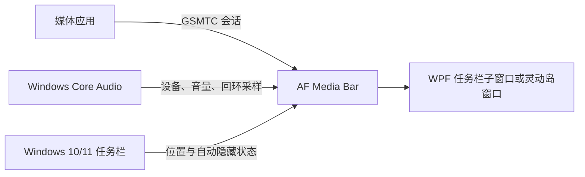

# AF Media Bar

<div align="center">

  <a href="https://github.com/Fervent-Tempo/AF-Media-Bar/releases">
    
  </a>
  <a href="https://github.com/Fervent-Tempo/AF-Media-Bar/releases">
    
  </a>
  <a href="https://github.com/Fervent-Tempo/AF-Media-Bar/stargazers">
    
  </a>
  <a href="https://github.com/Fervent-Tempo/AF-Media-Bar/issues">
    
  </a>
  <a href="LICENSE">
    
  </a>

  <br><br>

  

  <h1>AF Media Bar</h1>

  <p>Windows 10/11 任务栏上的媒体控制、音频设备切换与轻量系统指标。</p>

  <p>
    简体中文
    ·
    <a href="README.en-US.md">English</a>
    <br>
    <a href="#安装">快速开始</a>
    ·
    <a href="https://github.com/Fervent-Tempo/AF-Media-Bar/issues/new?template=bug_report.yml">报告问题</a>
    ·
    <a href="https://github.com/Fervent-Tempo/AF-Media-Bar/issues/new?template=feature_request.yml">功能建议</a>
  </p>

</div>

## 展示

### 运行展示


<div align="center">


</div>


### 介绍视频


### - [在 Bilibili 观看 AF Media Bar 介绍视频](https://www.bilibili.com/video/BV1Bjuq6bErr)


## 目录


- [AF Media Bar](#af-media-bar)
  - [展示](#展示)
    - [运行展示](#运行展示)
    - [介绍视频](#介绍视频)
    - [- 在 Bilibili 观看 AF Media Bar 介绍视频](#--在-bilibili-观看-af-media-bar-介绍视频)
  - [目录](#目录)
  - [简介](#简介)
  - [功能](#功能)
  - [工作方式](#工作方式)
  - [安装](#安装)
    - [系统要求](#系统要求)
    - [推荐方式](#推荐方式)
  - [使用](#使用)
  - [更新与卸载](#更新与卸载)
    - [更新](#更新)
    - [卸载](#卸载)
  - [隐私与安全](#隐私与安全)
  - [从源码构建](#从源码构建)
  - [项目结构](#项目结构)
  - [参与贡献](#参与贡献)
  - [License](#license)


## 简介

AF Media Bar 是一款便携式 Windows 10/11 媒体控制器。它读取 Windows 全局系统媒体会话（GSMTC），显示当前媒体的封面、标题和作者，并提供上一首、播放/暂停、下一首和来源切换。

程序以独立进程运行，可以将 WPF 播放器窗口挂载为任务栏子窗口，也可以作为可自由拖动、支持边缘收起的灵动岛窗口运行；它不修改、不向 `explorer.exe` 注入代码。网易云音乐、QQ 音乐、Spotify、浏览器等应用只要向 Windows 发布媒体会话，就可以被发现和控制。
## 功能
<div align="center">


| 类别 | 功能 |
| --- | --- |
| 媒体控制 | 上一首、播放/暂停、下一首、循环、点击轨道直接跳转或拖动进度；不可用按钮保持透明并降低图标不透明度；完整层始终保留显式按钮 |
| 来源交互 | 点击标题或歌词切回媒体应用；右键媒体栏切换来源 |
| 曲目切换通知 | 可选显示刚切换并开始播放的当前曲目，支持六个位置、1–10 秒、全屏抑制，以及固定显示器或前台窗口所在显示器 |
| 实时歌词 | 歌词只存在于任务栏静置层；可用时自动替换标题与歌手/来源，并在独立歌词页设置双行内容和对齐 |
| 任务栏适配 | 横向任务栏保留原播放器静置外观；控制层直接模糊/淡化原文字区并保持按钮清晰，完整层位于任务栏外；可独立选择固定目标显示器 |
| 窗口模式 | 设置页展示任务栏、灵动岛、悬浮球、桌面卡片四种模式；当前任务栏和灵动岛可用，后两种在固定外观稳定后开发 |
| 外观设置 | 字体、字重、播放器文字、应用主题与窗口材质全局统一；自动文字色按任务栏实际底色或透明区域后的壁纸切换深浅，复杂背景增加轻微反色阴影；任务栏主体当前固定透明，灵动岛表面可调节风格、不透明度和圆角 |
| 轻度自定义 | 可开关悬停层/完整层并选择信息密度、内容布局、内容跟随/固定长度与交互方式；固定长度受当前悬停层最小值和任务栏可用区间限制，长标题、歌手和歌词使用跑马灯；完整层提供紧凑/完整预设及四组显隐 |
| 信息密度 | 极简、均衡、信息优先会统一改变按钮、进度与封面—文字—频谱间隔；悬停最小宽度只约束中间文字区，无媒体时不保留该空白区域 |
| 自动隐藏 | 可在所有媒体会话均停止播放时隐藏；折叠容器使用锚点容器和公共边展开，四向折叠仍需真实 Windows 验收 |
| 托盘音频控制 | 左键单击可选无操作、设置或音频面板；滚轮独立选择输出设备、调节当前媒体音量或禁用，不读取播放器手势映射 |
| 音频设备 | 在稳定排序的设备列表中切换默认输出设备；音频控制窗与完整层均可滚轮预览，并在停止滚动后应用 |
| 应用音量 | 面板跨活动输出端点聚合应用图标和音频会话；音频控制窗、完整层及托盘滚轮均按 2% 调节当前媒体应用音量 |
| 音频可视化 | 基于 WASAPI 回环采样的九段频谱，仅在媒体源正在播放时于收起状态显示；无媒体时只保留音符占位 |
| 系统指标 | 完整面板按可见内容自动调整高度；可选显示系统内存、CPU、GPU 与 AF Media Bar 进程内存，隐藏后停止采样；频谱默认不进入完整面板 |
| 低性能自动降级 | 检测到 WPF 软件渲染或低性能路径时，自动关闭装饰性连续动效、滚动文字、频谱缓动、模糊和窗口材质效果 |

</div>


## 工作方式
<div align="center">



</div>

Windows 10/11 控制中心里的媒体卡片是 Explorer/Shell 的内部界面，不是公开可嵌入的控件。AF Media Bar 复用其背后的公开 GSMTC 接口，并自行渲染界面，从而避免注入 Explorer 带来的稳定性和安全风险。

## 安装

### 系统要求

- Windows 10 版本 1809（内部版本 17763）或更高版本，x64
- 使用推荐的自包含版本时，无需另行安装 .NET

### 推荐方式

1. 打开 [Releases](https://github.com/Fervent-Tempo/AF-Media-Bar/releases)。
2. 下载最新的 `AFMediaBar-vX.Y.Z-win-x64.zip`，不要下载 GitHub 自动生成的 Source code 压缩包。
3. 解压后会得到单个自包含的 `AFMediaBar.exe`，不再附带数百个 .NET 运行时文件。
4. 将它放到一个长期保留且可写的目录，例如 `D:\AFMediaBar`，然后运行。
5. 右键播放器或托盘图标打开设置，在“显示模式、交互、歌词、全局外观”中完成轻度自定义。

AF Media Bar 暂未进行商业代码签名，因此 Windows SmartScreen 可能在首次运行时显示未知发布者提示。

## 使用
<div align="center">

| 操作 | 结果 |
| --- | --- |
| 点击封面 | 在“混合操作”或“手势优先”中播放/暂停当前媒体；“按钮优先”只使用可见按钮 |
| 点击标题或歌词 | 切回当前媒体应用 |
| 在媒体区域向上/向下滚轮 | 默认切换上一首/下一首，也可改为循环切换媒体源；不控制系统输出设备或应用音量 |
| 右键媒体栏并选择“切换媒体源” | 在多个媒体会话之间切换 |
| 在“显示模式”中启用曲目切换通知 | 曲目真正切换并开始播放时显示当前曲目；可选择位置、时长、全屏策略及固定/前台目标显示器 |
| 在“显示模式”中选择任务栏目标显示器 | 关闭已打开的完整面板，并通过安全重载链把任务栏媒体栏重建到目标屏；目标暂时断开时回退主屏且保留原偏好 |
| 在“显示模式”中关闭内容长度跟随 | 在当前悬停层最小长度与任务栏可用长度之间选择固定值；超出的标题、歌手和歌词在裁剪区域内往返滚动 |
| 单击 AF Media Bar 托盘图标 | 打开输出设备、空间音效状态和应用音量面板 |
| 在音频控制窗或完整层的输出设备行滚轮 | 立即预览设备，停止滚动约 1.2 秒后切换；完整层设备框为长名称提供更大的显示区域和完整提示 |
| 悬浮 AF Media Bar 托盘图标 | 使用 Windows 原生提示显示默认滚轮操作及当前值 |
| 在托盘图标上滚轮 | 独立切换输出设备或按 2% 调节当前媒体音量；设备候选立即更新原生提示，停止滚动约 1.2 秒后应用 |
| 悬停任务栏媒体栏 | 有媒体时封面、文字和播放中的频谱分别显示原控件 hover；控制层打开时直接模糊/淡化原文字，按钮保持清晰；关闭悬停层后可用文字区顶部细杠打开完整层 |
| 点击空间音效行 | 显示当前空间音效并打开“系统 > 声音 > 所有声音设备”；第三方应用不能可靠代替系统切换 Dolby/DTS 模式 |
| 拖动长条空白区域 | 调整手动位置，锁定后禁止拖动 |
| 切换到灵动岛模式 | 将播放器拖到桌面任意位置；拖到边缘后暂停时自动收起，播放时展开常驻 |
| 将边缘折叠容器放到桌面边缘 | 鼠标移到触发区域时展开；移开后隐藏组件内容 |
| 右键播放器或托盘图标 | 打开详细设置、媒体操作与退出菜单；左键点击菜单外部即关闭 |


</div>

媒体应用必须向 Windows 发布 GSMTC 会话。部分播放器需要在自身设置中启用“系统媒体控制”“媒体键”或“SMTC”。

曲目切换通知不读取播放队列，也不是“下一首预览”；Windows SMTC 不提供待播列表。它只根据“来源标识 + 标准化标题”识别当前曲目变化，因此同一来源中连续播放两首同名曲目无法可靠区分。真正的待播列表需要播放器专用 API 或插件。

## 更新与卸载

### 更新

程序启动后会延迟检查版本清单，每天最多自动检查一次；该功能可以在“详细设置 → 常规 → 获取更新”中关闭。也可以在此处立即检查，并从 GitHub、夸克网盘、百度网盘或蓝奏云等已配置渠道打开下载页面。

当前版本只负责获取更新信息和打开下载链接，不会在后台静默替换正在运行的程序。安装更新时：

1. 从托盘菜单退出 AF Media Bar。
2. 下载并解压新版本。
3. 用新的 `AFMediaBar.exe` 替换旧版本后重新启动。

用户偏好和窗口状态统一保存在 `%LOCALAPPDATA%\AFMediaBar\settings.json`，采用版本化 JSON、原子写入和备份恢复。布局档案及组件属性仍保存在 `%LOCALAPPDATA%\AFMediaBar\profiles\layout.json`。替换程序文件不会丢失设置；可在设置的常规页打开设置文件夹。

### 卸载

1. 在右键菜单中关闭“开机启动”，然后退出程序。
2. 删除 AF Media Bar 程序目录。
3. 如需同时清除设置，可在 PowerShell 中执行：

```powershell
Remove-Item "$env:LOCALAPPDATA\AFMediaBar" -Recurse -Force
```

## 隐私与安全

- 不包含遥测、广告、账号系统或联网分析代码。
- 更新检查请求公开的 `latest.json` 版本清单；歌词和远程封面功能还会按当前媒体信息请求已配置的歌词/图片服务，不上传设备信息或用户设置。
- 媒体信息、系统指标和音量操作均在本机处理。
- 程序以当前用户权限运行，不请求管理员权限，也不向 Explorer 注入代码。
- 安全问题请按 [SECURITY.md](SECURITY.md) 私下报告，不要在公开 Issue 中披露利用细节。

## 从源码构建

需要 Windows 10 版本 1809 或更高版本、[.NET 10 SDK](https://dotnet.microsoft.com/download/dotnet/10.0) 和 PowerShell。仓库通过 `global.json` 固定受支持的 SDK 特性带（feature band）。

```powershell
git clone https://github.com/Fervent-Tempo/AF-Media-Bar.git
cd AF-Media-Bar
dotnet restore .\src\AFMediaBar.slnx
dotnet build .\src\AFMediaBar.slnx -c Release --no-restore
dotnet test .\src\AFMediaBar.slnx -c Release --no-build
dotnet run --project .\src\AFMediaBar\AFMediaBar.csproj
```

生成供普通用户使用的自包含单文件：

```powershell
dotnet publish .\src\AFMediaBar\AFMediaBar.csproj -c Release -r win-x64 --self-contained true -o .\artifacts\AFMediaBar-win-x64
```

## 项目结构


```text
AF-Media-Bar/
├── .github/
│   ├── ISSUE_TEMPLATE/            # Issue 表单
│   └── workflows/                 # 构建与发布工作流
├── src/
│   └── AFMediaBar/                # WPF 应用主项目
│       ├── Classes/               # 核心业务逻辑和服务
│       │   ├── Abstractions/      # 抽象接口定义
│       │   ├── Converters/        # WPF 值转换器
│       │   ├── Interop/           # Windows API 互操作
│       │   ├── Models/            # 数据模型
│       │   │   └── Layout/        # 布局数据模型（LayoutSchema、ComponentConfig 等）
│       │   ├── Services/          # 业务服务
│       │   │   ├── Layout/        # 布局预设和渲染引擎
│       │   │   ├── Lyrics/        # 歌词服务（网易云音乐歌词获取与解析）
│       │   │   ├── Players/       # 媒体播放器服务
│       │   │   └── Win32/         # Windows 系统服务
│       │   ├── Settings/          # 设置管理
│       │   └── Utils/             # 工具类
│       ├── Components/            # 可复用 UI 组件（TaskBarMediaControl 等）
│       ├── ViewModels/            # MVVM ViewModels
│       │   ├── Pages/             # 页面 ViewModel
│       │   └── Windows/           # 窗口 ViewModel
│       └── Views/                 # XAML 视图
│           ├── Pages/             # 设置页面视图
│           └── Windows/           # 窗口视图
├── docs/                          # 项目文档与资源
├── AFMediaBar.slnx                # 解决方案文件
└── README.md                      # 项目说明
```


## 参与贡献

提交问题或代码前请阅读 [CONTRIBUTING.md](CONTRIBUTING.md)。错误报告请附 Windows 版本、AF Media Bar 版本、媒体播放器和完整复现步骤。

版本变化记录见 [CHANGELOG.md](CHANGELOG.md)。

## License

AF Media Bar 使用 [MIT License](LICENSE) 开源。

<div align="center">

如果 AF Media Bar 对你有帮助，可以给项目一个 Star❤️。

</div>
